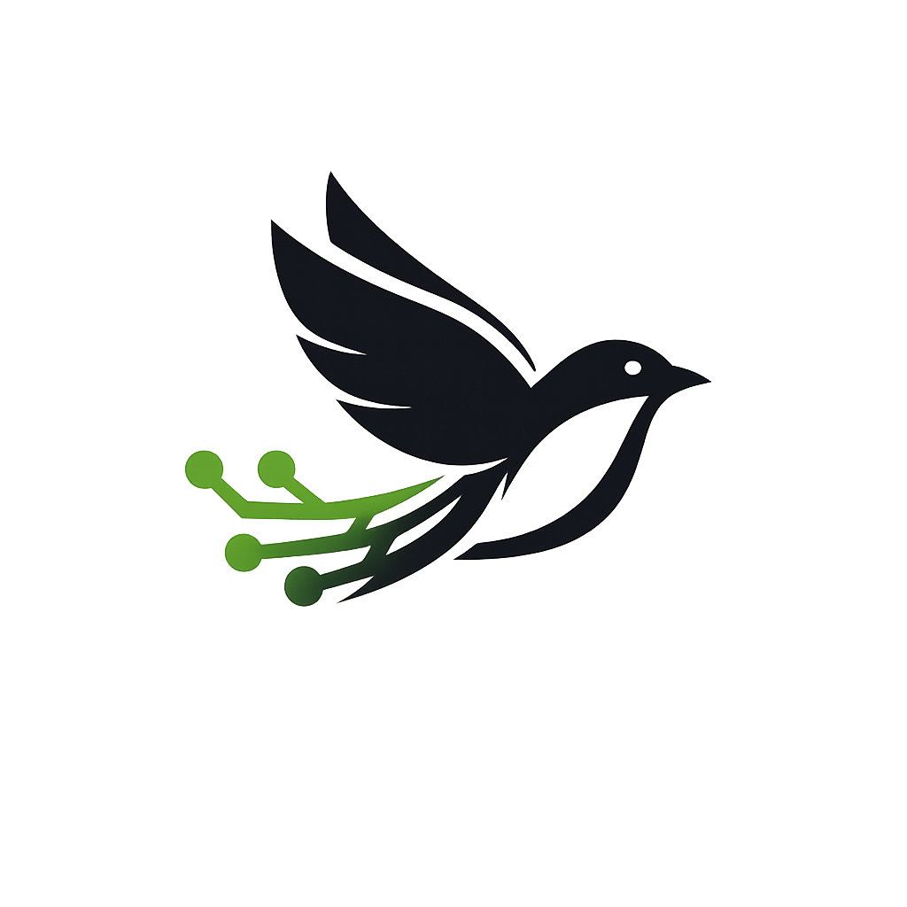

<div align="center">


<br>


<br><br>


</div>

---

<div align="center">


### `SYSTEM INITIALIZED`


</div>

<br>

<table align="center" width="92%">
<tr>
<td width="50%" valign="top">

## `01 / IDENTITY`

Je suis **AnARCHIS12**, développeur et administrateur systèmes & réseaux.

Je construis des logiciels, des infrastructures et des services libres en privilégiant :

* Linux
* réseaux
* administration systèmes
* Docker et conteneurisation
* auto-hébergement
* sécurité
* automatisation
* outils libres
* respect de la vie privée

Mon objectif n'est pas simplement de créer du logiciel.

**Je construis l'infrastructure qui permet au logiciel d'exister.**

</td>

<td width="50%" valign="top">

## `02 / CURRENT STATE`

```text
┌──────────────────────────────────────┐
│              ANARCHIS12              │
├──────────────────────────────────────┤
│ OS             Linux                 │
│ Focus          Systems / Networks    │
│ Containers     Docker                │
│ Infrastructure Self-hosted           │
│ Development    PHP / Python / JS     │
│ Mobile         Flutter               │
│ Automation     CI/CD                 │
│ Philosophy     Free Software         │
├──────────────────────────────────────┤
│ STATUS         ONLINE                │
└──────────────────────────────────────┘
```

</td>
</tr>
</table>

<br>

<div align="center">


</div>

---

# `03 / PROJECT MATRIX`

<div align="center">


</div>

<br>

<table align="center" width="95%">

<tr>

<td align="center" width="33%" valign="top">


### MILITANT

Plateforme sociale libre et décentralisée.

[GitLab](https://gitlab.com/militant1)

</td>

<td align="center" width="33%" valign="top">


### OPENCODE OLLAMA INSTALLER

Installation simplifiée d'OpenCode et Ollama.

[GitLab](https://gitlab.com/anarchymedialibertaire/opencode-ollama-installer)

</td>

<td align="center" width="33%" valign="top">


### REVSEARCH

Moteur de recherche orienté confidentialité.

[GitLab](https://gitlab.com/anarchymedialibertaire-group/revsearch)

</td>

</tr>

<tr>

<td align="center" valign="top">


### ANARCOSYNDICALISMEBOOK

Projet de documentation et de lecture libre.

[Codeberg](https://codeberg.org/Anarcosyndicalismebook)

</td>

<td align="center" valign="top">


### ANARTECH

Projet orienté technologie et informatique libre.

[GitLab](https://gitlab.com/anartech/anartech)

</td>

<td align="center" valign="top">


### LIBERCOMPRESS

Outil libre autour de la compression de fichiers.

[GitLab](https://gitlab.com/anarchymedialibertaire/libercompress)

</td>

</tr>

<tr>

<td align="center" valign="top">


### CODESTRAL-AGENT

Expérimentation autour des agents de développement.

[GitHub](https://github.com/AnARCHIS12/Codestral-Agent)

</td>

<td align="center" valign="top">


### CKEKSAFE

Projet libre de sécurité.

[GitHub](https://github.com/AnARCHIS12/cKEKSAFE)

</td>

<td align="center" valign="top">


### SAFELINK

Projet libre autour de la sécurité des liens.

[GitHub](https://github.com/AnARCHIS12/Safelink)

</td>

</tr>

<tr>

<td align="center" valign="top">


### DOCKAN

Conteneurisation libre.

[GitHub](https://github.com/Dockan-Conteneurisation-libre)

</td>

<td align="center" valign="top">


### LIBERCHAT

Projet de communication libre.

[GitHub](https://github.com/Liberchat)

</td>

<td align="center" valign="top">


### YOUTUBE DOWNLOADER

Outil libre de téléchargement vidéo.

[GitHub](https://github.com/AnARCHIS12/YouTube-Downloader)

</td>

</tr>

<tr>

<td align="center" valign="top">



### GITLIBERTY

Infrastructure Git auto-hébergée.

[Gitliberty](https://gitliberty.unionlibertaireanarchiste.org/anar/Gitliberty)

</td>

<td align="center" valign="top">


### AUTOSERVER-CONFIG

Automatisation et configuration de serveurs.

[Gitliberty](https://gitliberty.unionlibertaireanarchiste.org/anar/Autoserver-config)

</td>

<td align="center" valign="top">


### RSS FACTORY

Outils autour des flux RSS.

[GitLab](https://gitlab.com/anarchymedialibertaire-group/rss-factory)

</td>

</tr>

</table>

<br>

<div align="center">


</div>

---

# `04 / ORGANIZATIONS`

<table align="center" width="90%">
<tr>

<td align="center" width="50%">


<br><br>

Infrastructure et projets logiciels libres.

<br><br>

[anarchymedialibertaire](https://gitlab.com/anarchymedialibertaire)

</td>

<td align="center" width="50%">


<br><br>

Espace ASR sur Codeberg.

<br><br>

[ASR2026](https://codeberg.org/ASR2026)

</td>

</tr>
</table>

---

<div align="center">


</div>

# `05 / STACK`

<div align="center">


</div>

<br>

<table align="center">
<tr>
<td>

```text
SYSTEMS
Linux
Debian
Fedora
Ubuntu
Virtualisation
Docker
```

</td>
<td>

```text
NETWORK
TCP/IP
DNS
HTTP / HTTPS
Reverse Proxy
VPN
Firewall
Monitoring
```

</td>
<td>

```text
DEVELOPMENT
PHP
Python
JavaScript
HTML
CSS
Flutter
SQL
Bash
```

</td>
<td>

```text
INFRASTRUCTURE
Docker Compose
Git
CI/CD
Self-hosting
Monitoring
Automation
Security
```

</td>
</tr>
</table>

---

# `06 / INFRASTRUCTURE`

<div align="center">


</div>

<br>

```text
                         INTERNET
                            |
                            v
                  +-------------------+
                  |   REVERSE PROXY   |
                  |   TLS / ROUTING   |
                  +---------+---------+
                            |
              +-------------+-------------+
              |             |             |
              v             v             v
          WEB APPS       SERVICES      APIs
              |             |             |
              +-------------+-------------+
                            |
                            v
                   +----------------+
                   |    DOCKER      |
                   |  CONTAINERS    |
                   +--------+-------+
                            |
             +--------------+--------------+
             |              |             |
             v              v             v
          DATABASES      STORAGE       MONITORING
```

<div align="center">


</div>

---

# `07 / OPEN SOURCE NETWORK`

<div align="center">

```text
GITHUB
   |
   +------ GITLAB
   |
   +------ CODEBERG
   |
   +------ GITLIBERTY
   |
   +------ SELF-HOSTED INFRASTRUCTURE
   |
   +------ FREE SOFTWARE
```

</div>

<br>

<table align="center" width="90%">
<tr>
<td align="center">

### GITHUB

Development, experiments and public projects.

</td>
<td align="center">

### GITLAB

Software and collaborative infrastructure.

</td>
<td align="center">

### CODEBERG

Free and open-source forge.

</td>
<td align="center">

### GITLIBERTY

Self-hosted Git infrastructure.

</td>
</tr>
</table>

---

# `08 / LIVE ACTIVITY`

<div align="center">


<br><br>


</div>

---

# `09 / CONTRIBUTION ENGINE`

<div align="center">


</div>

<br>

<div align="center">


</div>

---

# `10 / CURRENTLY BUILDING`

<div align="center">

<table width="90%">
<tr>

<td width="33%" align="center">

```text
NETWORK
SYSTEMS
SERVER
```

Administration et infrastructure.

</td>

<td width="33%" align="center">

```text
OPEN
SOURCE
SOFTWARE
```

Logiciels et outils libres.

</td>

<td width="33%" align="center">

```text
SELF
HOSTED
SERVICES
```

Services autonomes.

</td>

</tr>
</table>

</div>

---

<div align="center">


<br>


<br><br>

<table align="center">
<tr>
<td align="center">

[GitHub](https://github.com/AnARCHIS12)

</td>
<td align="center">

[GitLab](https://gitlab.com/anarchymedialibertaire)

</td>
<td align="center">

[Codeberg](https://codeberg.org/ASR2026)

</td>
<td align="center">

[ASR](https://asr.revlibertaire.com/)

</td>
</tr>
</table>

<br>


</div>
